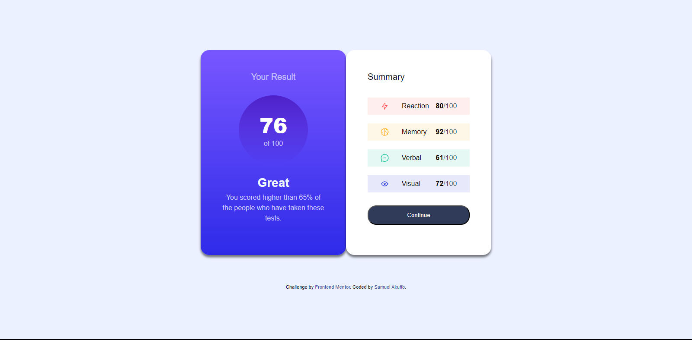

# Frontend Mentor - Results summary component solution

This is a solution to the [Results summary component challenge on Frontend Mentor](https://www.frontendmentor.io/challenges/results-summary-component-CE_K6s0maV). Frontend Mentor challenges help you improve your coding skills by building realistic projects. 

## Table of contents

- [Overview](#overview)
  - [The challenge](#the-challenge)
  - [Screenshot](#screenshot)
  - [Links](#links)
- [My process](#my-process)
  - [Built with](#built-with)
  - [What I learned](#what-i-learned)
  - [Continued development](#continued-development)
  - [Useful resources](#useful-resources)
- [Author](#author)
- [Acknowledgments](#acknowledgments)


## Overview

### The challenge

Users should be able to:

- View the optimal layout for the interface depending on their device's screen size
- See hover and focus states for all interactive elements on the page
- **Bonus**: Use the local JSON data to dynamically populate the content

### Screenshot



### Links

- Solution URL: (https://https://github.com/KwameSA/resultsummary)
- Live Site URL: (https://https://kwamesa.github.io/resultsummary/)

## My process

### Built with

- Semantic HTML5 markup
- CSS custom properties
- Flexbox
- CSS Variables
*

### What I learned


```html
<button class="continue">
  Continue
 </button>
```
```css
background: linear-gradient(to bottom, var(--clr-Violet-blue), var(--clr-Persian-blue));
.score-number p {
  border-radius: 50%;
  aspect-ratio: 1/1;
  display: flex;
  height: 10rem;
  width: 10rem;
  flex-direction: column;
  justify-content: center;
  align-items: center;
}
```

### Continued development
I still want to improve on my understanding on the use of flexbox
I want to futher learn how to use CSS Variables to make workflow easier.
The use of variables to make workflow smooth and easy has further motivated me to go in harder as I am learning JavaScript
I want to understand how to better use media queries


### Useful resources

Irvine Mesa and Kevin Powell helped me increase workflow and reduce redundancy

## Author

- Website - [KwameSA](https://github.com/KwameSA)
- Frontend Mentor - [@KwameSA](https://www.frontendmentor.io/profile/KwameSA)
- Twitter - [@Kwame_Deezy_](https://www.twitter.com/Kwame_Deezy_)


## Acknowledgments

Thanks to myself for not giving up and working to find a solution!

